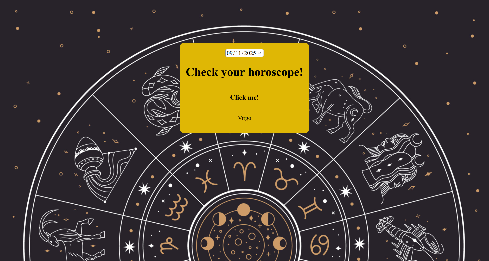

My Awesome Project

This project is a horoscope app that allows you to enter your birthday and find your horosope!

Link to project: https://horoscopejustin.netlify.app/

How It's Made:

Tech used: HTML, CSS, JavaScript

This app was created around the Date object, and simple if statements. The date object is a bit tricky sometimes, and the timezone by default makes the dates you enter actually become the day before. So my solution was to simply subtract one from the day property, and that seemed to work. Then i also made some logic to make sure all the dates matched the horoscopes.

Optimizations

I would definitely change the timezone instead of subtracting 1 from the day

Lessons Learned:

I learned a lot about the date object, and i had fun using if statements to make simple logic. The date object is fun and functions in unique ways.